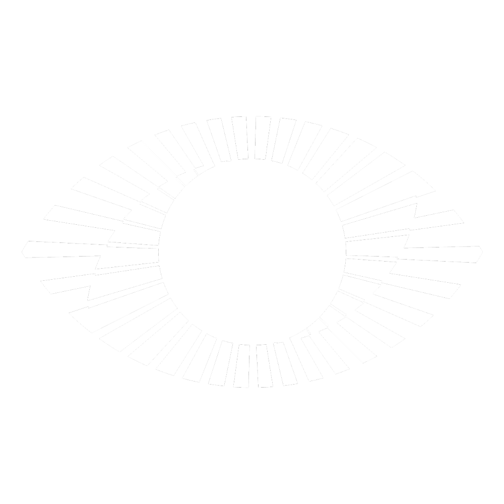

# Fractree Logo Generator – Animatable & Recordable

  

DEMO: [https://yudikubota.github.io/fractree-elements/](https://yudikubota.github.io/fractree-elements/)

A web-based tool for designing, animating, and exporting dynamic Fractree-style logos.
Control all visual parameters (radii, spoke count, thickness, angles, masks) with sliders, animate them with per-parameter velocity, and record smooth SVG-to-video output.

## Features

* **Live SVG preview** – Instantly see all changes in real time.
* **Fine parameter control** – Adjust radii, spoke count, thickness, angles, mask rotation, and more.
* **Per-parameter animation** – Set individual velocities (in px/s, deg/s, or spokes/s) for smooth, precise animation.
* **Play/Pause** – Animate any combination of parameters.
* **Record & Export** – Record the animation directly as a `.webm` video (using built-in canvas and MediaRecorder).
* **Two-layer composition** – Independently control both the front and back layer, each with its own spoke offset and thickness gradient.
* **Mask system** – Dynamically rotate and shape the A/B masks.
* **Dark/light mode friendly** – Clean, modern UI.
* **No dependencies** – All code is client-side and vanilla JS/HTML/CSS.

## Usage

1. **Open `index.html` in a modern browser** (Chromium-based browsers recommended for video export).
2. **Adjust the sliders** to design your logo.
3. **Set velocities** (number input beside each parameter) for those you want to animate.
4. Press **Play** to animate; **Pause** to stop.
5. To record the animation:

   * Click **Start Recording**. The tool records the merged logo as you see it.
   * When ready, click **Stop & Download** to get your `.webm` video.

## Controls

* **r (inner):** Inner radius (px)
* **d (offset):** Offset for annulus thickness (px)
* **Spoke count:** Number of radial spokes
* **Min/Max thick:** Spoke width at thinnest and thickest points (px)
* **Peak angle:** Angle (deg) where spokes are thickest
* **Front/Back start:** Rotational offset for each layer (deg)
* **Mask rotation:** Rotates the A/B split and windows (deg)
* **Colours:** Pick for front/back layers
* **Invert direction:** Flips spoke thickness gradient direction
* **Per-parameter velocity:** Number input next to each parameter, controls how fast it animates (zero = static)

## Recording/Export Notes

* **Works best in Chromium-based browsers** (Chrome, Edge, Brave, Vivaldi, Opera, etc.)
* Video exported as `.webm` at 30 fps.
* Canvas is not shown to the user; all capture is from the SVG itself, so quality is high.

## Known Limitations

* Video export is not available in Firefox or Safari (no canvas.captureStream()).
* Only the merged image is recorded (not the two layers separately).
* Colour pickers are not animatable (static for now).

## Credits

* Designed & coded by Yudi Kubota.
* Inspired by the Fractree project and mathematical/psychedelic visual art.
